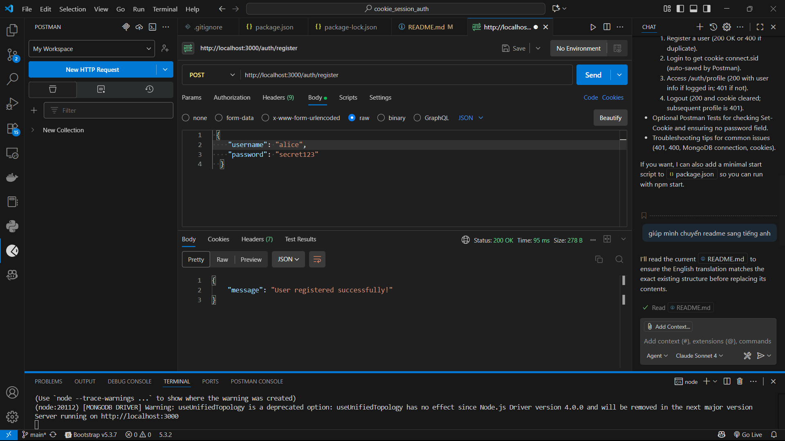

# Postman Testing Guide (Cookie + Session Auth)

This project demonstrates login with sessions and cookies using Express, express-session, and connect-mongo.

## Requirements
- Node.js and npm
- MongoDB running locally at `mongodb://127.0.0.1:27017/sessionAuth`
- Postman (Cookie Jar enabled by default)

## Run the app
From the `cookie_session_auth` project folder:

```batch
npm install
node app.js
```

Server URL: `http://localhost:3000`

## Endpoints
- POST `/auth/register` – Register
- POST `/auth/login` – Login (returns `connect.sid` cookie)
- GET  `/auth/profile` – Get user info (requires session cookie)
- GET  `/auth/logout` – Logout (destroys session, clears cookie)

## Postman testing (minimal)
Tip: create a Collection, add the 4 requests below, and use the base URL `http://localhost:3000`.

1) Register
- Method: POST
- URL: `http://localhost:3000/auth/register`
- Body (JSON):
  ```json
  {
    "username": "alice",
    "password": "secret123"
  }
  ```
- Expected: `200 OK` with `{ "message": "User registered successfully!" }`.

- Check in Database

- Note: Duplicate `username` returns `400 Bad Request`.
2) Login (receive session cookie)
- Method: POST
- URL: `http://localhost:3000/auth/login`
- Body (JSON):
  ```json
  {
    "username": "alice",
    "password": "secret123"
  }
  ```
- Expected: `200 OK` with `{ "message": "Login successful!" }`.

- Check in Database

- Postman will store the `connect.sid` Set-Cookie in the Cookie Jar for `localhost`.

3) Profile (requires `connect.sid`)
- Method: GET
- URL: `http://localhost:3000/auth/profile`
- Expected when logged in: `200 OK` with user info (no `password` field).


- If not logged in or cookie missing: `401 Unauthorized`.

4) Logout
- Method: GET
- URL: `http://localhost:3000/auth/logout`
- Expected: `200 OK` with `{ "message": "Logout successful!" }` and cookie cleared.

- - Check in Database

- Calling step (3) again should return `401 Unauthorized`.


## Common issues and quick fixes
- 401 on `/auth/profile`: not logged in or Postman didn’t send cookies.
  - Ensure you just logged in successfully; check the Cookies tab for `connect.sid`.
  - In Postman Settings > Cookies: ensure “Enable cookie jar” is ON.
- 400 on register: username already exists. Use a different username or clear the DB.
- MongoDB connection issues: make sure MongoDB runs at `127.0.0.1:27017` and the `sessionAuth` database is available.
- No cookie on Login:
  - Check response headers contain `Set-Cookie`.
  - App sets `secure: false`, so cookie is sent over HTTP (suitable for local use).

## Notes
- Sessions are stored in MongoDB (connect-mongo). The session cookie name is `connect.sid` and it’s `httpOnly`.
- After restarting the server, the session may change; you might need to log in again before calling `/auth/profile`.
